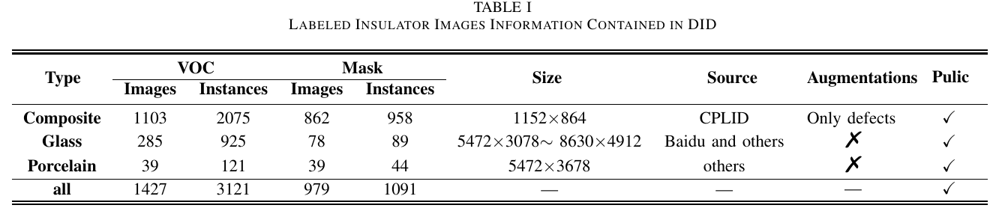
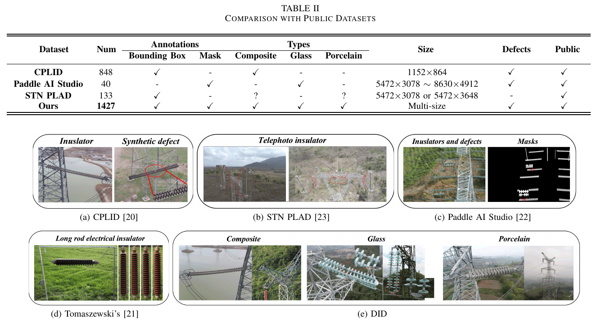

# DID

This is the  Diverse Insulator Dataset (DID).  It is based on publicly available images of insulators. The complete dataset is available at https://drive.google.com/*/***

## Properties

DID has 1182 original insulator images containing three insulator types.

The 3121 bounding box annotations for object detection, the 1091 masks for instance segmentation, and the defects on insulators are also in the dataset. ***VOC*** meant that it was labeled in PASCAL VOC format while ***Mask*** represented that it only had mask marking information.  ***VOC***  contains defects, and the defects are augmented. We do not make defect masks

### Compared with other datasets

### VOC

 We used ***labelImg***  to label the image with bounding boxes and tested it.

The results of the detection of DID based on YOLOv5

### Mask

 We used ***Lableme***  to mark the insulator outline and then generated mask images based on it.

The results of Mask-RCNN

