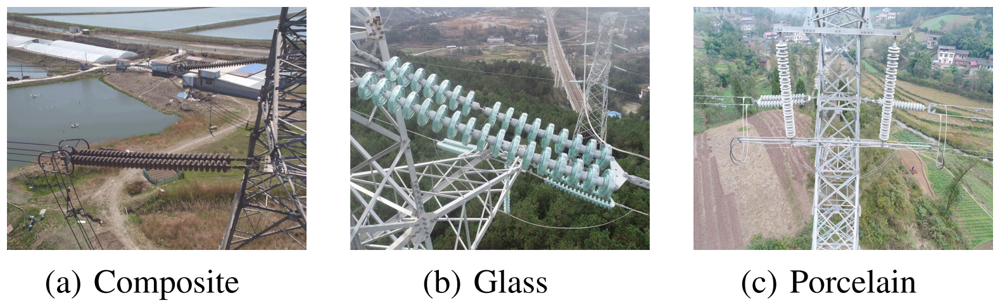
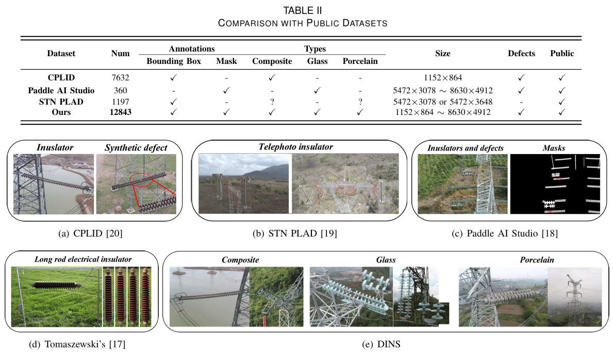
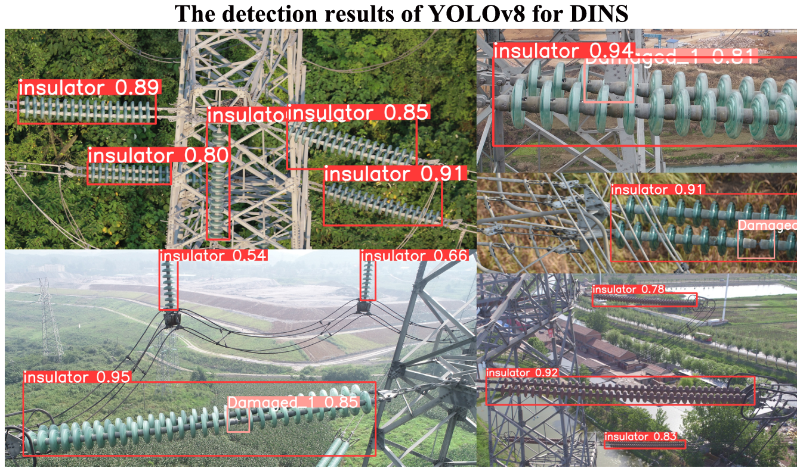
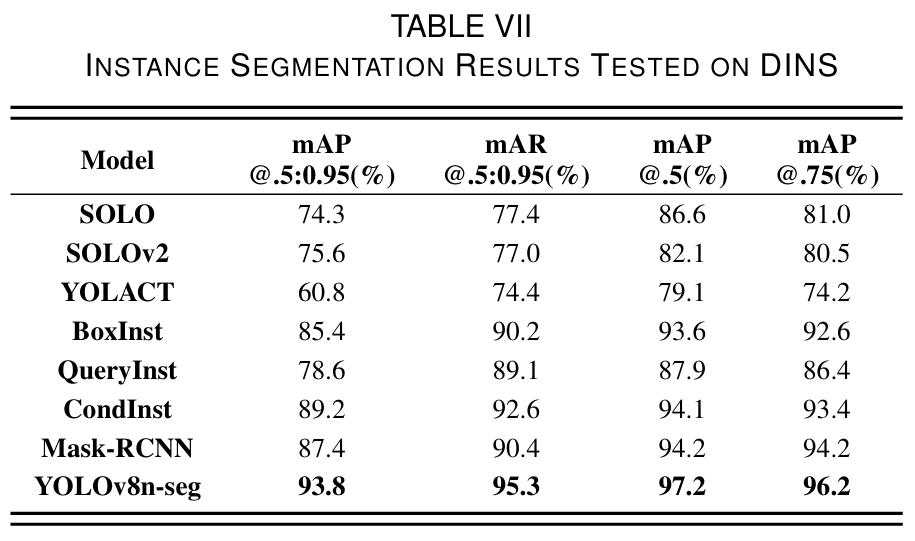

# DINs

This is the  Diverse Insulator Dataset (DINs).  It is based on publicly available images of insulators. [Click here to download.](#Download link)

## Properties

DINs contains three types of insulators: composite, glass, and porcelain insulators. There are over twenty-five thousand bounding boxes for object detection and nine thousand masks for instance segmentation. 

Compared to other public insulator datasets, DINs provides a diverse set of image data, including various types of insulators, varied image resolution, and backgrounds that more accurately reflect the actual working conditions of insulators.

DINS consists of two parts: ***VOC*** and ***Mask***. The ***VOC*** means that it was labeled in PASCAL VOC format while ***Mask*** represented that it only had mask marking information. ***VOC*** contains defects, and the defects are augmented. We do not make defect masks.

### VOC

 We used ***LabelImg***  to label the image with bounding boxes and tested it.

The results of the detection of DINs. 

Visualization based on YOLOv8

### Mask

 We used ***Lableme***  to mark the insulator outline and then generated mask images based on it.

The results of the instance segmentation of DINs.

Visualization based on Mask-RCNN.

<h2 id="Download link">Download link</h2>

Due to limited cloud storage space, only the complete mask data has been uploaded while the VOC only provides the original unaugmented version.

### VOC

[the original unaugmented](https://drive.google.com/file/d/1NPAYjM99kRGda5aiBZBCK0rGdLewVYyE/view?usp=drive_link)

### Mask

[the original unaugmented](https://drive.google.com/file/d/1_fSHetSP1GhPQnWymcp_9wUgWC8wJiO4/view?usp=drive_link)

[the complete data](https://drive.google.com/file/d/1Yk9YFotOr-mAY89xxml23YkYSXDQc9kn/view?usp=drive_link)

## Abstract

Intelligent defect detection of insulators is faster, more accurate, standardized, and cheaper than manual detection with necessary massive inspection work. Insulator datasets are important for training detection models. Nevertheless, public datasets are scarce and lack variety which hampers improving detection accuracy and achieving industrial-grade accuracy. We construct a comprehensive beyond the current insulator dataset – the Diverse Insulator Dataset (DINS). DINS contains over ten thousand insulator images involving three insulator types (porcelain, glass, and composite) and defects. We annotate over twenty-five thousand bounding boxes for object detection and nine thousand masks for instance segmentation. DINS has much more scale and diversity than the current insulator datasets. Eventually, we discussed the effective augmentation methods for DINS and conducted some experiments demonstrating the usefulness of DINS with 98.3% mAP of object detection and 97.2% mAP of instance segmentation. 
